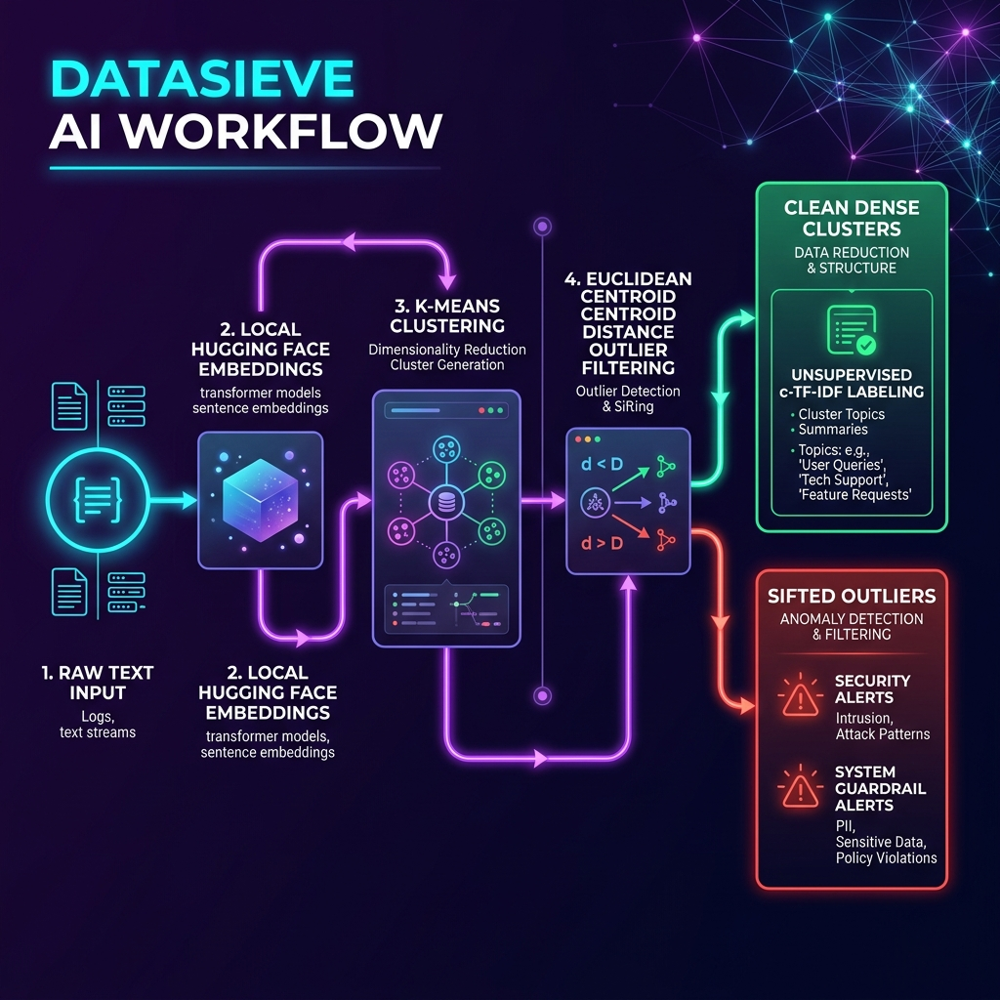

# 🔍 DataSieve AI - Automated Data Sanitization & Pattern Discovery Engine

DataSieve AI is an automated, unsupervised data ingestion and cleaning gateway. It is designed to sanitize raw textual data (crawled web data, chat logs, customer feedback, synthetic inputs) by filtering out noise, outliers, and security threats before they poison retrieval systems (RAG) or machine learning/deep learning training pipelines.

---

## 📐 High-Level Architecture Workflow

The system operates as an unsupervised gateway that uses sentence embeddings, K-Means clustering, and distance-to-centroid thresholding to isolate structural noise and identify patterns.



---

## 🛠️ Step-by-Step Run & Launch Guide

This application runs locally in a **single Docker container** containing both a **FastAPI backend** (port `8001`) and a **Streamlit frontend** (port `8502`). All embedding and clustering steps run fully locally on CPU inside the container.

### 📋 Prerequisites
Make sure you have [Docker](https://www.docker.com/products/docker-desktop/) and [Docker Compose](https://docs.docker.com/compose/) installed on your machine.

---

### 🚀 Running with Docker Compose (Recommended)

1. **Navigate to the Project Directory:**
   ```bash
   cd /DataSieveAI
   ```

2. **Build and Run the Container:**
   ```bash
   docker-compose up --build
   ```
   *Note: During the build stage, the container pre-downloads and caches the Hugging Face `all-MiniLM-L6-v2` transformer model (~90MB). This ensures that once the container starts, it operates completely offline and launches instantly.*

3. **Access the Applications:**
   *   **Streamlit Frontend (UI):** Open your browser to [http://localhost:8502](http://localhost:8502)
   *   **FastAPI Backend (API docs):** Open your browser to [http://localhost:8001/docs](http://localhost:8001/docs)

4. **Shutdown the Container:**
   To stop the services, press `Ctrl + C` or run:
   ```bash
   docker-compose down
   ```

---

### 🐳 Running with Standard Docker CLI

If you prefer using the Docker CLI directly:

1. **Build the Image:**
   ```bash
   docker build -t datasieve-ai .
   ```

2. **Run the Container:**
   ```bash
   docker run -p 8502:8502 -p 8001:8001 datasieve-ai
   ```

---

## ⚙️ Configuration & Usage in the Dashboard

Once the Streamlit interface is loaded at `http://localhost:8502`:

### Step 1: Ingest Data
Choose one of the two ingestion methods in the left sidebar:
*   **Load Synthetic RAG Dataset:** Click **"Generate Synthetic Data"** to load a pre-configured mixture of customer support requests, code tracebacks, random gibberish, SQL injection scripts, and spam text.
*   **Upload CSV File:** Upload any CSV file, and select the text column you wish to sanitize.

### Step 2: Configure Clustering & Sieve Parameters
*   **Number of Clusters (K-Means K):** Adjust this slider (2-12) to control how many semantic groupings are created from your dataset.
*   **Outlier Distance Percentile:** Adjust this slider (50%-99%). Points whose Euclidean distance to their assigned K-Means centroid falls in the top $(100 - \text{Percentile})$ are flagged as outliers. For example, a setting of `90%` isolates the most distant 10% of items as noise.

### Step 3: Run and Analyze
*   Click **"⚡ Run Sieve Engine"**.
*   **Visual Cluster Map:** View a 2D PCA projection of your text embeddings. Hover over points to read the raw text. Outliers are automatically highlighted in bright red.
*   **Discovered Topics & Clusters:** Browse clusters labeled automatically using **c-TF-IDF (Class-based TF-IDF)** keywords.
*   **System Guardrails & Threats:** Inspect real-time alerts for malicious patterns (e.g. SQL Injections, XSS scripts, or system errors). Use these terms to update your firewalls or API gateway rules.
*   **Clean Dataset Export:** Preview and download the pristine core dataset (`datasieve_cleaned_dataset.csv`) or download the isolated outliers (`datasieve_isolated_outliers.csv`) for security audits.

---

## 💡 How the Unsupervised Engine Works Under the Hood

### 1. Local Semantic Embedding
Rather than rigid regular expression rules, texts are fed into the Hugging Face `all-MiniLM-L6-v2` Sentence Transformer. This encodes sentences into 384-dimensional dense vectors where semantically similar texts are positioned close together.

### 2. K-Means Clustering
The backend fits a K-Means model on the dense vectors to separate the data into $K$ core topic clusters.

### 3. Euclidean Outlier Isolation (Unsupervised Sifting)
Because K-Means forces every data point into a cluster, outlier text (e.g. system tracebacks or random string gibberish) will end up in the cluster but lie far away from the centroid. The engine computes the Euclidean distance:
$$d_i = \| \vec{v}_i - \vec{c}_k \|$$
Points with $d_i > \text{threshold}$ are automatically labeled as **outliers (Label -1)** and sifted out of the clean dataset.

### 4. Topic Discovery via c-TF-IDF
For each clean cluster, all member texts are grouped into a single class document. The engine computes Class-based TF-IDF:
$$\text{c-TF-IDF}_{i, c} = \text{TF}_{i, c} \times \log\left(1 + \frac{C}{\sum_c \text{TF}_{i, c}}\right)$$
where $C$ is the number of clusters, extracting the top 5 most representative terms to auto-label the cluster (e.g. *password, reset, mail*).

### 5. Guardrail Threat Scanning
A regex scanner scans the isolated outliers and clusters for specific indicators (e.g. SQL Injection patterns, `<script>` tags, or database traceback logs) and prints severity warnings in the UI dashboard, enabling rapid system pivots or firewall rule updates.

## Dashboard Demo

Live interactive demo here: https://tinyurl.com/36sa8vub

## Dashboard Sample View:


